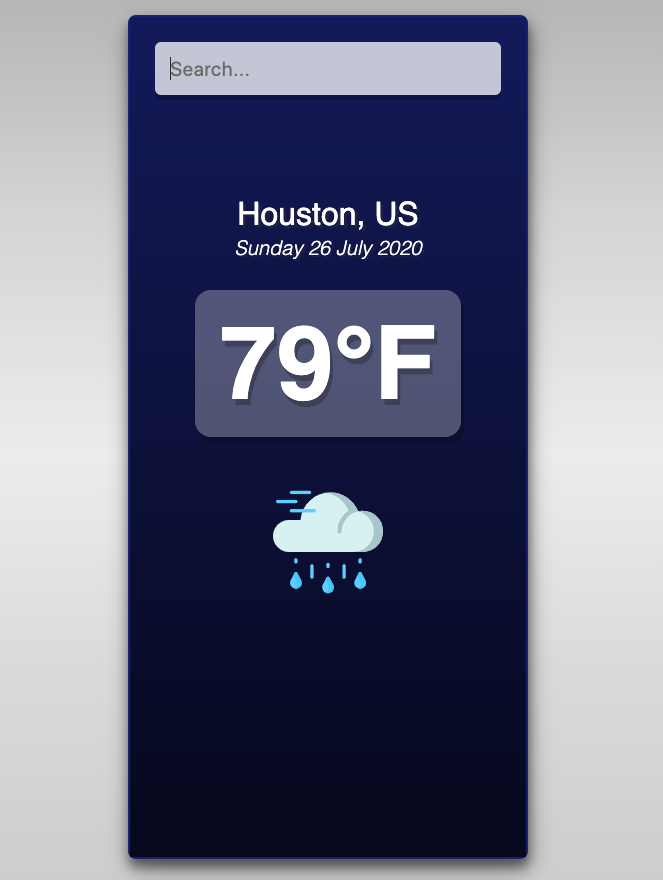

# Weather App with React

With this application you can check the weather of the city you enter in the search field.

### Technologies:
Javascript, React, HTML and CSS.

### Quick start:
Clone this repository. Make sure you have installed node and npm.

#### Installation:

##### npm install

#### To Run Test Suite:

##### npm test

#### To Start Server:

##### npm start

#### Live:
https://weather-application-react.netlify.app/

